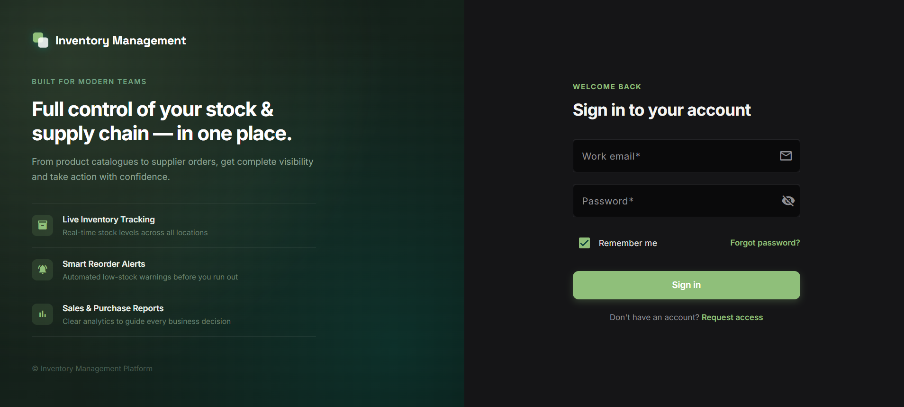
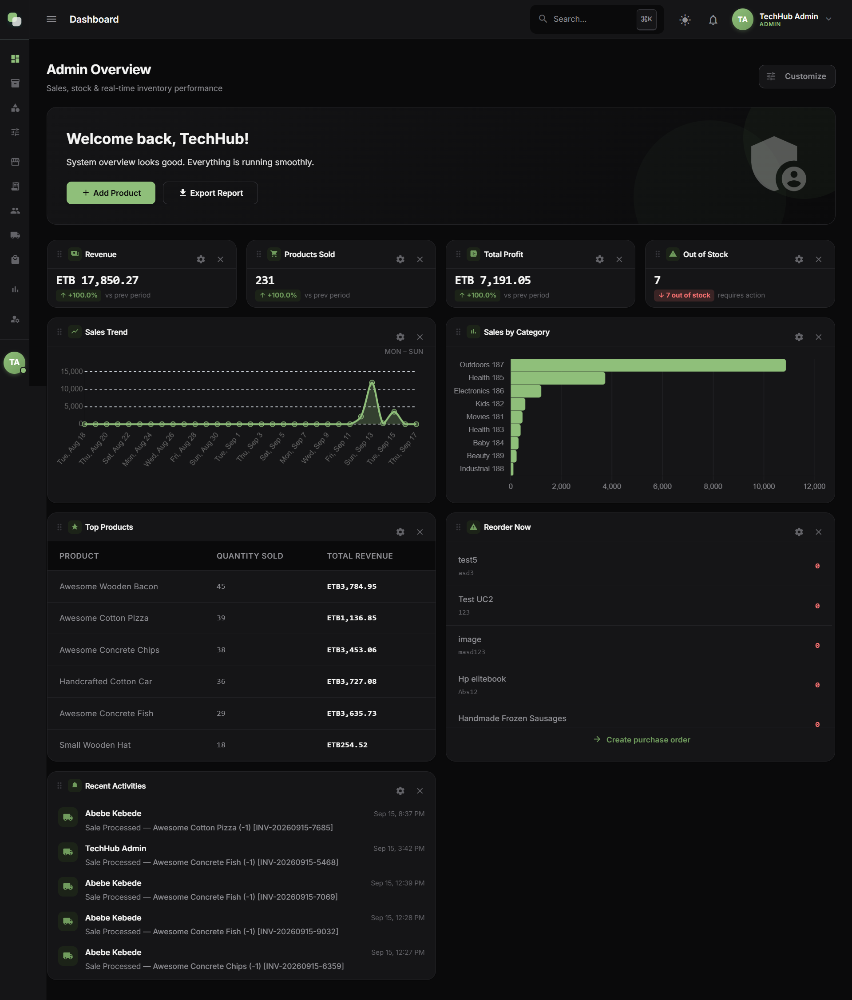
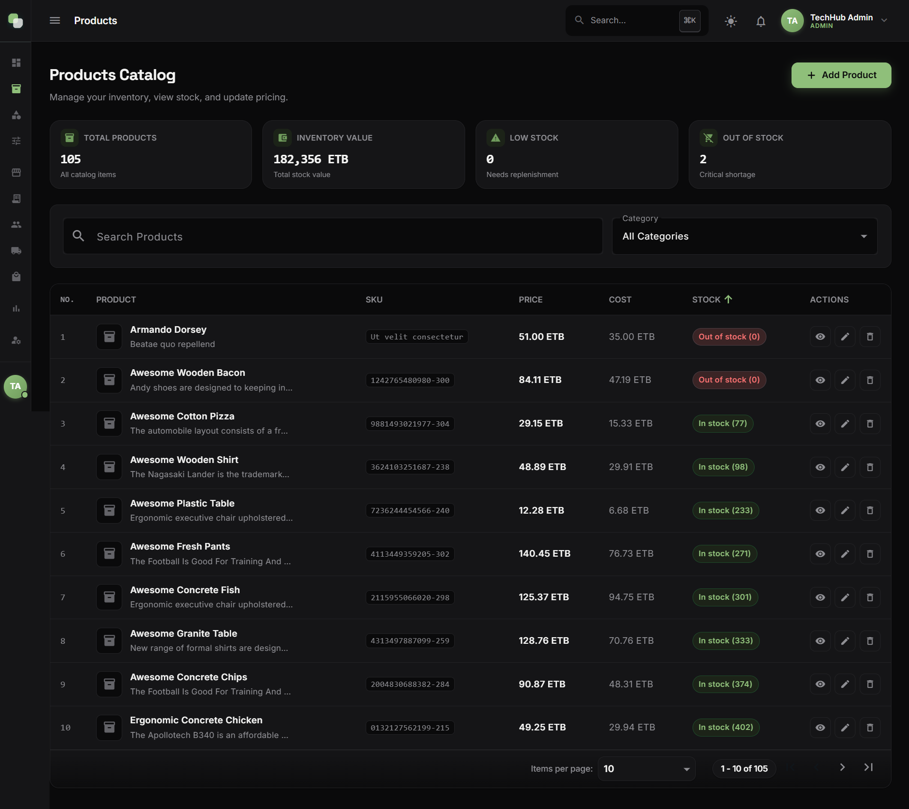
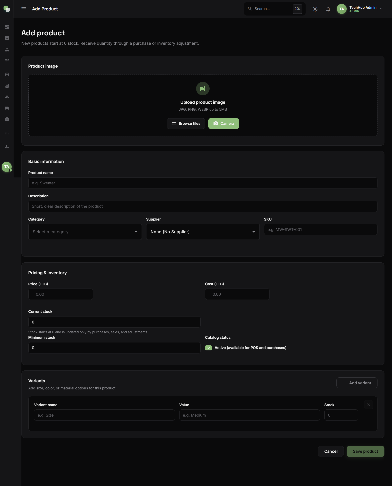
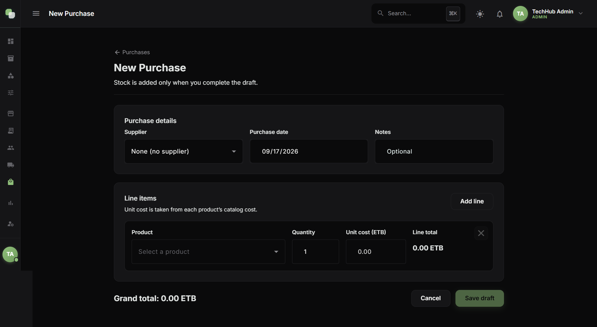
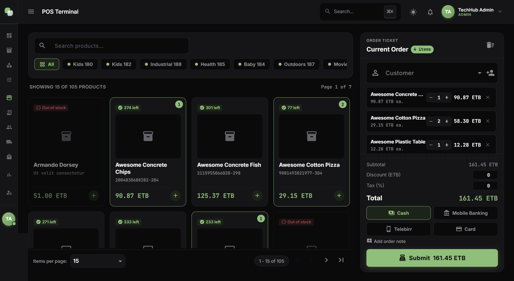
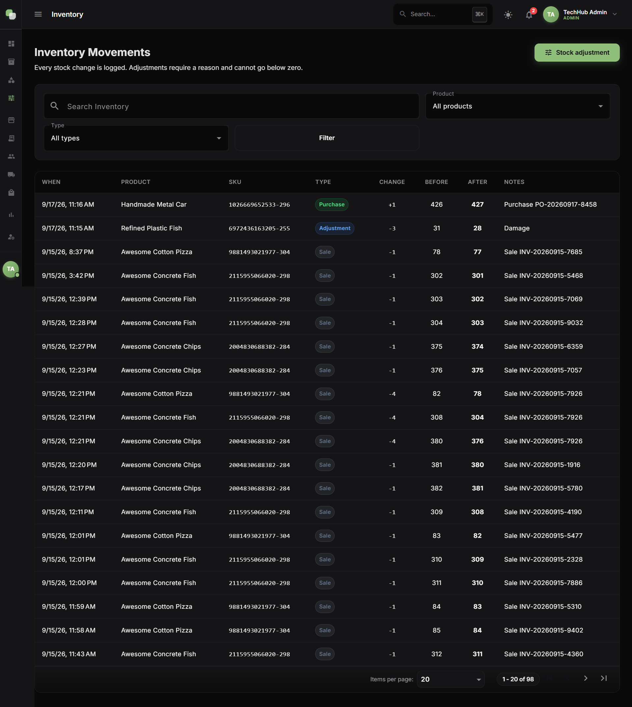
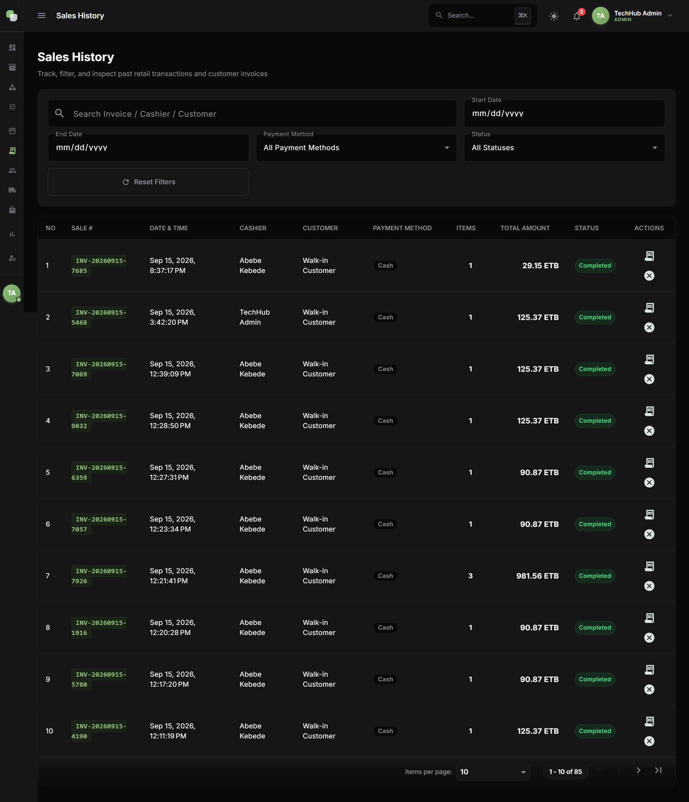
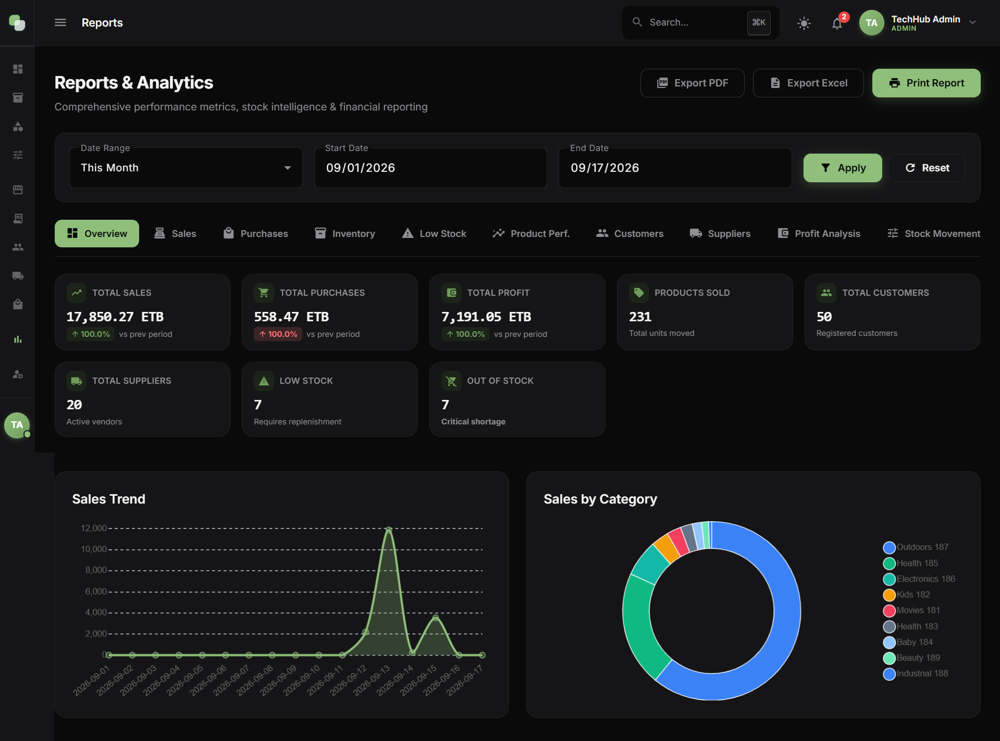
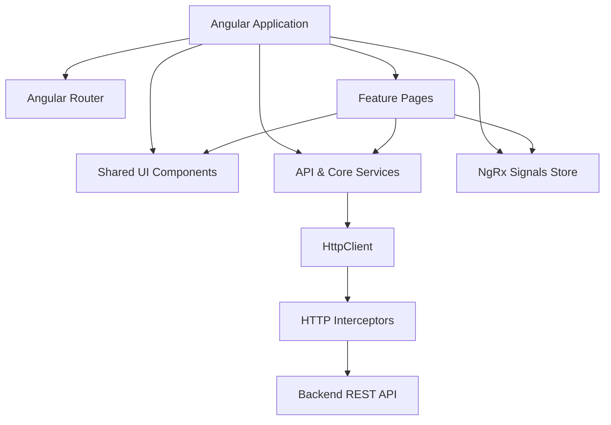

# Inventory Management System

A modern, responsive, and robust frontend application built with Angular for managing inventory, sales, purchasing, reporting, and business operations.

## Overview

The Inventory Management System is a feature-rich application designed to provide an intuitive interface for business owners, managers, and sales staff. It allows authorized users to track stock levels, process sales through a dedicated Point-of-Sale (POS) terminal, manage product catalogs, and handle purchasing workflows. 

The application uses modern Angular features including standalone components and Zoneless change detection. State management is handled through NgRx Signals, providing a reactive and performant user experience. The UI is built with Angular Material and custom SCSS themes, and the application includes localization support for multiple languages. It communicates seamlessly with a RESTful .NET backend API and provides real-time updates where applicable.

## Screenshots

### Login



The login screen provides a clean authentication interface where users
enter their credentials to access the inventory management system.

---

### Dashboard



The dashboard provides an overview of important business information,
including sales, inventory status, stock alerts, purchases, and other
relevant business metrics.

---

### Products List



The products page allows authorized users to browse, search, filter,
and manage products, including important product information such as
SKU, pricing, category, and stock-related information.

---

### Add Product



The product form allows authorized users to create a new product and
provide relevant information such as product name, SKU, category,
pricing, inventory information, and product image where supported.

---

### Add Purchase



The purchase interface allows users to record incoming stock,
select suppliers, add purchase items, specify quantities and costs,
and complete purchase transactions.

---

### POS Terminal



The POS interface provides a streamlined sales workflow for quickly
selecting products, managing cart items, calculating totals, and
completing sales transactions.

---

### Inventory



The inventory interface provides visibility into current stock levels,
inventory status, stock movements, and low-stock products.

---

### Sales History



The sales history view allows users to track past transactions, review sales details, and monitor POS activity over time.

---

### Reports



The reports section provides detailed insights into business performance, helping management analyze sales trends, inventory status, and purchasing data.

## Key Features

### Authentication & Authorization
* User login and logout
* Authentication state persistence
* Role-based route guards (`SystemAdmin`, `Admin`, `Manager`, `Sales`)
* Protected API routes using JWT Interceptors
* Unauthorized access redirection

### Dashboard
* Dedicated dashboards based on user roles
* Business activity overview
* System-wide metrics (System Admin dashboard)

### Products
* Comprehensive product catalog listing
* Add, edit, and delete products
* Image upload and preview capabilities
* Product categorization

### Inventory
* Real-time stock overview
* Inventory tracking
* Low-stock warnings

### Purchases
* Create and edit purchase records
* Select and manage suppliers
* Purchase item quantity and cost management

### POS & Sales
* Streamlined point-of-sale interface
* Product selection and cart management
* Sales history tracking and detailed views

### System Administration & Settings
* User management (Add, edit, delete users)
* Company/Tenant management (System Admin)
* System activity logs
* Application and user preferences

## Application Modules

| Module | Description |
|---|---|
| Dashboard | Provides role-specific overviews of business activity and key metrics |
| Products | Manage, browse, and edit products |
| Categories | Manage product categories for classification |
| Inventory | Monitor stock levels and inventory activity |
| POS Terminal | Fast point-of-sale workflow for checkout |
| Sales History | Track past sales transactions |
| Purchases | Record and manage incoming stock and purchases |
| Customers | Manage customer records |
| Suppliers | Manage supplier records |
| Reports | View and generate business performance reports |
| Users | Manage access for different roles and staff |
| System Admin | Manage companies (tenants) and system-wide settings |
| Settings | Configure application and user preferences |
| Profile | View and update user profile information |

## Technology Stack

| Category | Technology |
|---|---|
| Framework | Angular 22 |
| Language | TypeScript |
| UI Components | Angular Material 22 |
| Styling | SCSS (Custom theme variables) |
| State Management | NgRx Signals (`@ngrx/signals`) |
| Localization | Transloco |
| HTTP Client | Angular HttpClient |
| Charts | Chart.js |
| Real-time | Microsoft SignalR (`@microsoft/signalr`) |
| Testing | Vitest |

## Frontend Architecture

The frontend follows a modern Angular architecture utilizing **Standalone Components** and a strict feature-based directory structure.

* **Standalone Architecture**: Components, directives, and pipes are standalone, removing the need for `NgModules`. 
* **Zoneless Change Detection**: The application utilizes Angular's `provideZonelessChangeDetection()` for optimal performance.
* **NgRx Signals Store**: State management is handled heavily by `@ngrx/signals` (`signalStore`). Each major feature (Auth, Products, Categories, Users, etc.) has an isolated local store in the `src/app/store` directory.
* **Services**: Encapsulate API communication using `HttpClient`.
* **Guards & Interceptors**: Role-based access control is handled by function-based guards, while HTTP Interceptors transparently attach JWTs and handle errors.
* **Shared UI Components**: Reusable components such as skeletons and dialogs are located in `src/app/ui/`.



## Project Structure

```text
src/
├── app/
│   ├── core/             # Core configurations (e.g., Transloco loader, Paginator)
│   ├── features/         # Feature-based pages (auth, dashboard, pos, products, etc.)
│   ├── guards/           # Role and authentication route guards
│   ├── interceptors/     # HTTP interceptors (JWT, Error, Credentials)
│   ├── layout/           # Shell layout and structural components
│   ├── models/           # TypeScript interfaces and types
│   ├── services/         # API communication and business logic services
│   ├── store/            # NgRx Signals stores (AuthStore, ProductStore, etc.)
│   ├── ui/               # Shared visual components (skeleton loaders, dialogs)
│   └── utils/            # Utility functions
├── assets/               # Static files and translation JSONs
├── environments/         # Environment-specific configuration files
├── styles/               # Global SCSS themes and Material customizations
├── main.ts               # Application entry point
└── styles.scss           # Global stylesheet
```

## Routing

The application uses lazy-loaded standalone components via the Angular Router. Major routes include:

| Route | Page / Component | Required Role |
|---|---|---|
| `/login` | Authentication Login | Public |
| `/dashboard` | Main Business Dashboard | Admin, Manager, Sales |
| `/products` | Products List | Admin, Manager, Sales |
| `/pos` | POS Terminal | Admin, Manager, Sales |
| `/sales-history` | Sales History | Admin, Manager, Sales |
| `/inventory` | Inventory Overview | Admin, Manager |
| `/purchases` | Purchases Management | Admin, Manager |
| `/reports` | Business Reports | Admin, Manager |
| `/settings` | System Settings | Admin, Manager, Sales |
| `/users` | User Management | Admin |
| `/system-admin/dashboard` | System Admin Dashboard | SystemAdmin |

## Authentication & Authorization

Authentication is managed purely on the frontend by verifying and storing JWT tokens.

* **Login Flow**: Users log in via the `AuthService`, which retrieves a token from the backend. The token and user profile are persisted in the `AuthStore`.
* **Interceptors**: `jwtInterceptor` attaches the Authorization header to all outgoing requests. `credentialsInterceptor` and `errorInterceptor` handle session validity and HTTP errors.
* **Guards**: `authGuard` prevents unauthenticated access, while `roleGuard` ensures users can only access routes permitted for their specific role (e.g., `Admin`, `Manager`, `Sales`, `SystemAdmin`).

## API Integration

Communication with the REST API is handled by feature-specific services in `src/app/services/` (e.g., `ProductService`, `AuthService`, `PurchaseService`).

* Features inject services to perform CRUD operations.
* Base URL configurations are supplied via environment variables (`apiUrl`).
* A local proxy (`proxy.conf.json`) rewrites `/api` and `/uploads` requests to the backend server (typically `http://localhost:5111`) to prevent CORS issues during local development.

## State Management

Application state is managed using **NgRx Signals** (`@ngrx/signals`), replacing traditional RxJS-heavy stores (like NgRx Store) with Angular's modern reactivity model.

Data flow generally follows:
1. **Component**: Reacts to user input.
2. **NgRx Signal Store** (`AuthStore`, `ProductStore`, etc.): Holds reactive state slices. Exposes `rxMethod` for asynchronous side effects.
3. **Service**: Makes the HTTP call and returns an Observable to the Store.
4. **State Update**: The Store patches the state, which instantly updates connected UI components via Signals.

## Forms & Validation

The application relies heavily on Angular's **Reactive Forms** module (`FormBuilder`, `Validators`).

* Forms are structured programmatically for complex validation.
* Custom error messages and submit/loading states are handled at the component level.
* Key forms include `AddProducts`, `PurchaseFormComponent`, `AddCompanyComponent`, and authentication forms.

## UI & Design System

The frontend visual design is powered by **Angular Material** and custom SCSS.

* **Theming**: A custom `styles.scss` controls Material theming colors, typography (Inter font), and button aesthetics.
* **Components**: Leverages Material components like MatSelect, MatIcon, MatFormField, etc.

## Localization

The application is localized using **Transloco** (`@jsverse/transloco`).

* **Supported Languages**: English (`en`), Amharic (`am`), Afaan Oromo (`om`).
* **Translation Files**: Stored natively. 
* Language preferences are managed through the Transloco configuration and the `LanguageService`, providing dynamic re-rendering upon language change.

## Responsive Design

The interface adapts smoothly to various screen sizes. While primarily targeted at desktop environments for intensive management tasks, Angular Material components inherently respond to fluid layout constraints, providing a functional experience across tablets and mobile viewports.

## Loading & Error States

UX patterns ensure users receive immediate feedback:

* **Skeleton Loaders**: `card-skeleton` and `table-skeleton` components provide modern loading states before data resolves.
* **Dialogs/Toasts**: The `notification.service.ts` and `confirm-dialog` handle user alerts, success confirmations, and error dialogs gracefully.
* **Error Interceptor**: Automatically traps failed HTTP responses to surface them cleanly in the UI.

## Prerequisites

Before running the application, ensure your environment meets the following requirements:

* **Node.js**: v18.19+ or v20.9+ recommended
* **npm**: (Package manager)
* **Angular CLI**: v22.1.2 or compatible

```bash
node --version
npm --version
ng version
```

## Installation

1. Clone the repository:
   ```bash
   git clone https://github.com/Eyob73/Inventory_Management_Client.git
   ```
2. Navigate into the frontend directory:
   ```bash
   cd Inventory_Management
   ```
3. Install dependencies:
   ```bash
   npm install
   ```

## Configuration

Development configuration is managed via `src/environments/environment.development.ts`. 

```typescript
export const environment = {
  production: false,
  apiUrl: '/api',
  vapidPublicKey: '<VAPID_KEY>'
};
```

During local development, API requests to `/api` are proxied to `http://localhost:5111` via `proxy.conf.json`.

## Running the Application

To start the local development server:

```bash
npm start
```
*(This triggers `ng serve` internally).*

Once compiled, navigate to `http://localhost:4200/` in your browser. The app will automatically reload if you modify source files.

## Production Build

To build the project for a production environment:

```bash
npm run build
```

This will compile the application and output the optimized, minified artifacts into the `dist/` directory.

## Testing

The project uses **Vitest** for unit testing. To run the tests:

```bash
npm test
```
## Roadmap

### Completed
* Angular 22 standalone architecture setup
* Routing and JWT-based role guards
* NgRx Signals integration for core entities (Auth, Products, Categories, Users)
* Angular Material and custom SCSS theming
* Transloco localization for English, Amharic, and Afaan Oromo
* Standardized UI components (Skeleton loaders, Dialogs)
* Core feature views: Dashboard, Products, Purchases, Sales/POS, System Admin

### Planned
* Comprehensive E2E testing
* Extended localization coverage across all dynamic error messages

## Development Guidelines

* **Standalone Components**: Do not introduce `NgModules`. Keep all new components standalone.
* **State Management**: Keep complex business logic out of components. Use `@ngrx/signals` stores for state handling, and inject services directly into the stores via `rxMethod` for API side-effects.
* **Styling**: Favor the global SCSS variables (`--moss`, `--ink`, `--paper`) and standard `.btn` utility classes over inline styles.
* **Localization**: Hardcoded strings in templates must be avoided. Use the `TranslocoDirective` or pipe for all user-facing text.

## Contributing

1. Fork the repository.
2. Create a feature branch (`git checkout -b feature/amazing-feature`).
3. Implement the change following the Development Guidelines.
4. Run tests and build checks (`npm test` & `npm run build`).
5. Verify the UI in the browser.
6. Commit the changes (`git commit -m 'feat: add amazing feature'`).
7. Open a pull request.

## Author

**Eyob Getachew**
